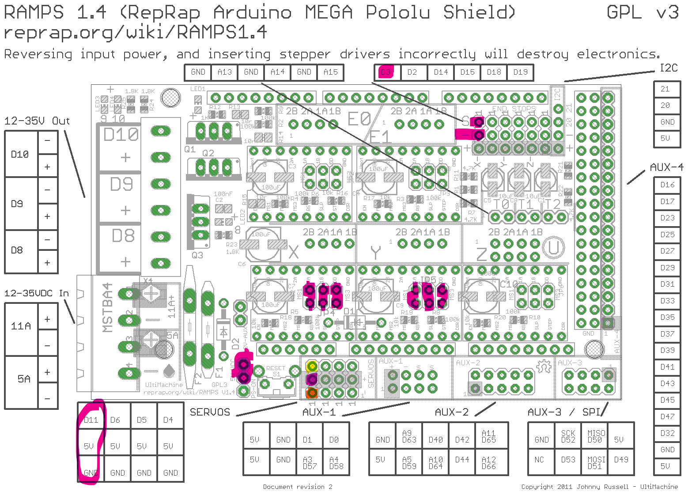

# CNC-sphere-o-bot

The Arduino code has been modified to work with a standard Arduino 3d-printer Ramps 1.4 shield. The pin declarations have been modified from the original source because the Ramps shield utilizes different pins than the shield this code was orgininally written for.  The original pin declarations appear (as remarks) in the code for reference.

The stepper drivers should be plugged into the X and Y sockets on the shield with the X driver connected to the rotation stepper, and the Y driver connected to the pen stepper.
I use DRV8825 which supports 32 microstepping, so i set this code at its max 16 microstepps, and modifies the python code that sends the command to convert it accordingly.

I run the sphere-o-bot with a modified version of the eggbot extension installed in inkscape 0.92 that you find [here](https://github.com/klalle/EggBot_Ramps_1.4)
See tutorial etc [here](https://wiki.evilmadscientist.com/The_Original_Egg-Bot_Kit)

### wiring
- **Servo that lifts the pen:**
    - BROWN--> GND, RED--> +5V, , YELLOW--> D11 (just next to the reset-btn)
    - Do not forget to jump the endstop-enable pins on the other side of the reset-btn to drive the servo.
- **Pause-btn**
    - pin D3 and GND
- **DRV8825** (X, Y) 
    - jumpers on all three pins underneath to enable 32 microstepping 
    - align the "en"-pin, which means the adjustment screw towards the reset-btn (and power)
    - adjust voltage to between 0.3v and 0.6v (measured between adjustment screw and gnd)

This is how I connected everything 

